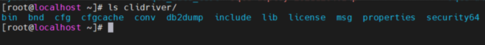
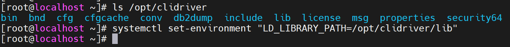
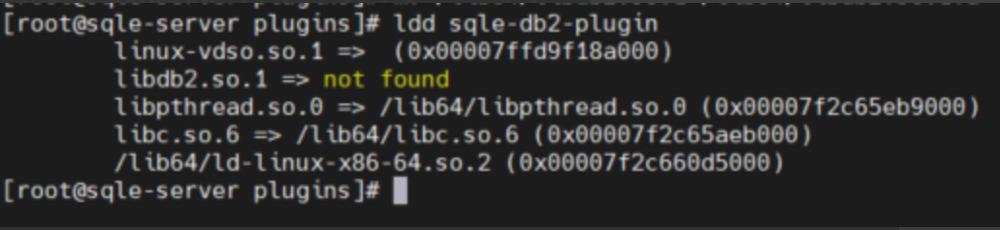

[中文文档](./README-CN.md)

## SQLE DB2 Plugin

This is A DB2 SQL audit for  [SQLE](https://github.com/actiontech/sqle), which is an SQL audit platform.

### 1. Add Rule

You can define a rule in coresponding file, and then add it to the plugin by `AddRule()` method. More details please
refer to [docs](https://actiontech.github.io/sqle-docs-cn/3.modules/3.7_auditplugin/auditplugin_development.html).

### 2. Build Binary

#### Docker compile

execute ```make docker_install```

The binary file is located in bin/ folder, and you can use it to audit your database.

### 3. Prepare the plugin runtime environment

1. Download the
   driver : https://public.dhe.ibm.com/ibmdl/export/pub/software/data/db2/drivers/odbc_cli/linuxx64_odbc_cli.tar.gz
2. Copy the driver to the machine where SQLE is deployed and decompress it. The decompressed directory is as follows
   
3. Execute the command to add environment variables for sqled, **${YOUR_DRIVER_LIB_PATH} needs to be replaced with the
   lib directory under the decompressed driver directory**

   ```systemctl set-environment "LD_LIBRARY_PATH=${YOUR_DRIVER_LIB_PATH}"```
   

4. restart sqled ```systemctl restart sqled```
   
   As you can see from the log, the db2 plugin starts to work

### 4. Begin to use

More details please refer
to [docs](https://actiontech.github.io/sqle-docs-cn/3.modules/3.7_auditplugin/auditplugin_management.html).


