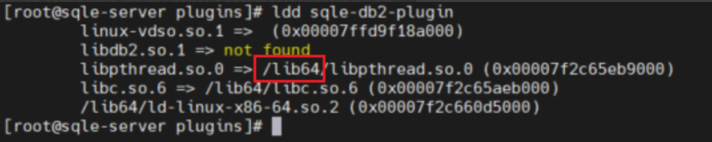
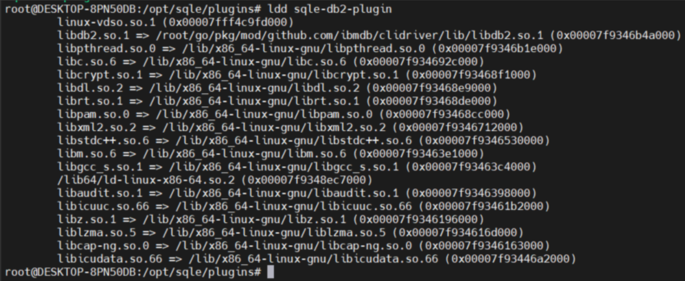

[中文文档](./README-CN.md)

## SQLE DB2 Plugin

This is A DB2 SQL audit for  [SQLE](https://github.com/actiontech/sqle), which is an SQL audit platform.

### 1. Add Rule

You can define a rule in coresponding file, and then add it to the plugin by `AddRule()` method. More details please
refer to [docs](https://actiontech.github.io/sqle-docs-cn/3.modules/3.7_auditplugin/auditplugin_development.html).

### 2. Build Binary

#### Docker compile

execute ```make docker_install```

The binary file is located in bin/ folder, and you can use it to audit your database.

### 3. Prepare the plugin runtime environment

1. Download the
   driver : https://public.dhe.ibm.com/ibmdl/export/pub/software/data/db2/drivers/odbc_cli/linuxx64_odbc_cli.tar.gz
2. Copy the driver to the machine where SQLE is deployed and decompress it. The decompressed directory is as follows
   
3. Copy the sqle-db 2-plugin plug-in to the SQLE plug-in directory
   
4. Use ldd to check the dependencies of sqle-db2-plugin, which should be as shown below
   
5. Copy all the contents in the lib folder in the second step driver directory to the directory where the dynamic link
   library referenced by the sqle-db2-plugin displayed by ldd is located. e.g. the dynamic library in the demo
   environment is in lib64, then copy it to lib64,
   **The target position of this item needs to be adjusted according to the actual situation**
   
6. Use ldd again to check whether the sqle-db2-plugin operating environment is configured correctly to ensure that there
   are no dependencies that cannot be found
   

### 4. Begin to use

More details please refer
to [docs](https://actiontech.github.io/sqle-docs-cn/3.modules/3.7_auditplugin/auditplugin_management.html).


